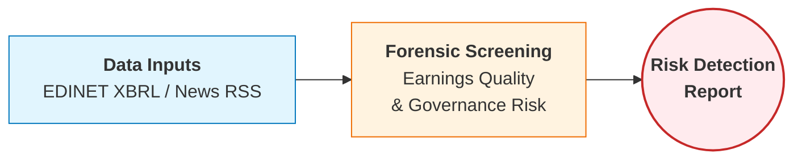

# Accounting Fraud Risk Screener
**Automated Detection of Earnings Manipulation using XBRL Data**


<br>

[](http://colab.research.google.com/github/macro-observer/Financial-Analytics-Portfolio/blob/main/01_Accounting_Fraud_Risk/analysis_demo.ipynb)
[](https://github.com/macro-observer/Financial-Analytics-Portfolio/blob/main/01_Accounting_Fraud_Risk/analysis_demo.ipynb)

## 📌 Executive Summary
本プロジェクトは、EDINET（金融庁開示システム）から取得した財務諸表データ（XBRL）に基づき、**「利益の質（Quality of Earnings）」** を分析して不正会計や将来の業績悪化リスクが高い企業をスクリーニングするツールです。

公認会計士が実施する監査手続の一部を自動化し、膨大な上場企業の中から**詳細な調査が必要な対象（Red Flags）** を抽出することを目的としています。

## ⚙️ System Workflow


*Note: 実際の不正検出事例の分析結果や詳細なコード解説は 📄[analysis_demo.ipynb](./analysis_demo.ipynb) を参照してください。*

## 🔍 Core Logic: Modified Sloan Ratio

現在の収益認識会計基準（支配移転モデル）においては、進捗率や引当金の見積もりに経営者の裁量が介入しやすく、これが「実体のない利益」として計上されるリスクがあります。本ツールは、Richard Sloan (1996) のアクルーアル・アノマリーを日本基準向けに修正した指標を採用しています。

$$ \text{Modified Sloan Ratio} = \frac{\text{Net Income} - \text{Operating Cash Flow}}{\text{Average Total Assets}} $$

*   **Rationale:** 日本基準特有の特別損益の影響を考慮し、営業利益ではなく**当期純利益（Net Income）** を使用することで、ボトムラインにおけるキャッシュ裏付けの欠如を捕捉します。
*   **Threshold:** スコアの絶対値が **0.10 (10%)** を超える場合、資産規模に対して過大なアクルーアル（未回収の売掛金や滞留在庫）が発生していると判定します。

## 📂 File Structure

```text
01_Accounting_Fraud_Risk/
│
├── fraud_screener.py    # 【実行用】スクリーニングスクリプト
│                        #  - 指定銘柄のXBRLを取得し、Sloan Ratioを計算・判定します。
│
├── analysis_demo.ipynb  # 【レポート】分析結果デモ
│                        #  - 検出された高リスク企業の事例分析と可視化。
│
├── requirements.txt     # 依存ライブラリ
└── README.md            # ドキュメント（本ファイル）

```
## 🚀 Usage

1. **依存ライブラリのインストール:**

   ```
   pip install -r requirements.txt
   ```

2. **APIキーの設定（推奨）:**
   EDINET APIキー（無料）が必要です。毎回手入力する手間を省くため、ルートディレクトリに `.env` ファイルを作成し、以下のように記述してください。

   ```
   EDINET_API_KEY=your_api_key_here
   ```

   *(設定しない場合、実行時に対話形式で入力が求められます)*

3. **スクリーニングの実行:**

   ```
   python fraud_screener.py
   ```

## ⚠️ Limitations
*   **Sector Bias:**
    金融業（銀行・保険）など、BS構造が特殊なセクターには本ロジックは適用できません。
*   **False Positives:**
    急成長企業（Startup）における運転資本の正常な増加を「リスク」として検知する可能性があります。本ツールはあくまで一次スクリーニング用であり、定性的な判断との併用が必須です。

    Author: CPA Researcher
